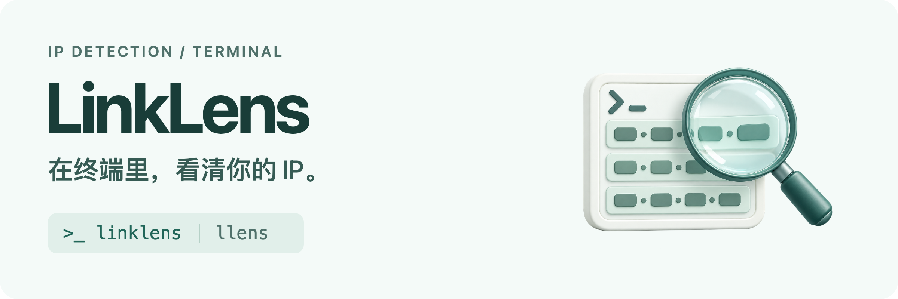
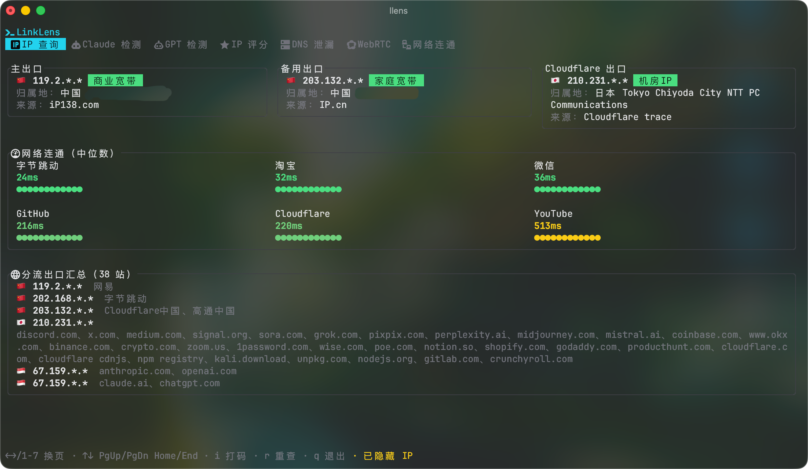
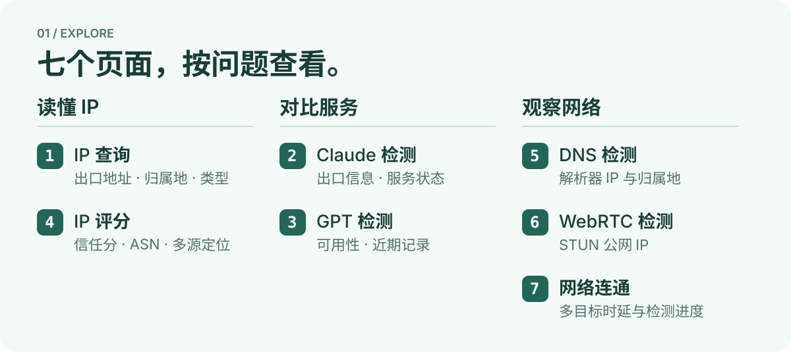
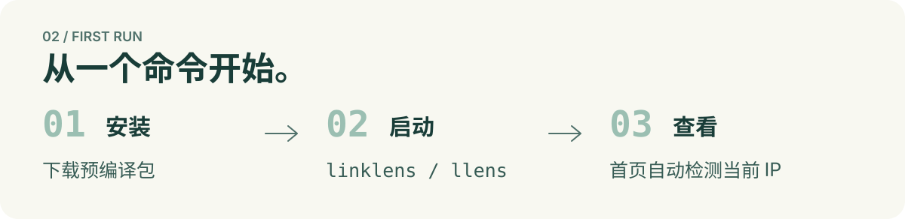
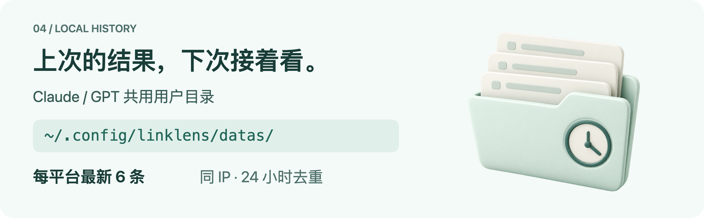

# LinkLens



**在终端里，看清你的 IP。**

LinkLens 是用 Rust 编写的交互式 IP 检测工具。查询出口地址、查看 IP 评分、对比不同服务的检测结果，常用信息集中在一个终端界面。

[快速开始](#快速开始) · [检测内容](#检测内容) · [操作指南](#操作指南) · [历史记录](#历史记录) · [更新程序](#更新程序)

<a href="./.assets/ip_lookup.png">
  
</a>

*实际终端截图，IP 已打码。点击图片可查看原图。*

## 检测内容



按 `1`–`7` 切换检测页面，结果会随检测进度逐步更新。

| 页面 | 可以查看 |
| --- | --- |
| IP 查询 | 多源出口 IP、归属地、IP 类型与各站点出口汇总 |
| Claude 检测 | 服务出口 IP、信任分、可用性、服务状态与近期记录 |
| GPT 检测 | 服务出口 IP、信任分、可用性、服务状态与近期记录 |
| IP 评分 | 任意 IPv4 / IPv6 的信任分、ASN、运营商、多源定位与场景评分 |
| DNS 检测 | 快速或深度检测，查看解析器 IP 与归属地 |
| WebRTC 检测 | 查看 STUN 探测得到的公网 IP 与检测状态 |
| 网络连通 | 多目标连通检测、成功样本的时延中位数与逐轮进度 |

窗口较宽时，卡片按内容高度组合排列；较窄时切换为单列。长结果可用键盘或鼠标滚轮查看。按 `i` 可隐藏界面中的 IP，方便截图分享。

## 快速开始



无需安装 Cargo 或 Rust。macOS / Linux 在终端执行：

```sh
curl -fsSL https://raw.githubusercontent.com/mel0nyrame/LinkLens/main/install.sh | sh
linklens
```

脚本自动选择系统和 CPU 对应的 Release，校验 SHA-256，然后将 `linklens`、`llens` 安装到 `~/.local/bin`。若该目录还未加入 `PATH`，按脚本提示执行一次 `export PATH="$HOME/.local/bin:$PATH"`，并把这行加入你的 shell 配置以供以后使用。

Windows x64 在 PowerShell 执行：

```powershell
irm https://raw.githubusercontent.com/mel0nyrame/LinkLens/main/install.ps1 | iex
linklens
```

Windows 安装到 `%LOCALAPPDATA%\LinkLens\bin`，并添加到用户 `PATH`。macOS、Linux 和 Windows Git Bash 也可以使用上面的 curl 脚本。安装选项：`LINKLENS_VERSION=v0.1.1` 可指定版本，`LINKLENS_INSTALL_DIR` 可指定目录；重新运行脚本即可更新程序。

也可以从 [Releases](https://github.com/mel0nyrame/LinkLens/releases/latest) 下载并解压匹配的包，直接运行 `linklens` 或 `llens`（Windows 使用 `.exe`），无需工具链。

| 系统 | 预编译架构 |
| --- | --- |
| Windows | x64 |
| macOS | Intel x64、Apple Silicon ARM64 |
| Linux | x64、ARM64（musl） |

建议使用支持中文、emoji 和 Nerd Font 图标的终端字体，并将窗口设为至少 90 列，以便查看多列卡片。

<details>
<summary>从源码构建（dev 分支）</summary>

先安装 [Rust 工具链](https://www.rust-lang.org/tools/install)，再运行：

```sh
git clone --branch dev https://github.com/mel0nyrame/LinkLens.git
cd LinkLens
cargo install --path . --locked
linklens
```

短命令 `llens` 使用同样的界面与历史记录。也可以通过 `cargo run --release` 直接运行，或通过 `cargo build --release --bins` 构建两个命令。

</details>

## 更新程序

自更新入口属于开发分支中的功能；现有不带自更新入口的 Release 须先重新运行原安装脚本，或下载新包升级一次。自更新程序包含官方发布版本和构建目标，普通源码构建仅提示按原方式升级，不替换本机程序。

在带自更新入口的官方程序中，两个命令等价：

```sh
linklens update
# 或
llens update
```

命令检查最新稳定版，只有新版高于本机版本时才下载、校验并更新实际安装目录内的 `linklens` 和 `llens`；缺少的命令一并补齐。支持自定义安装目录，不修改其他目录的副本，也不自动提权。检查失败会明确报错，已经最新与检查失败是不同结果。

官方程序的 TUI 每次启动在后台检查一次。发现新版后显示提示，按 `u` 打开弹窗；默认选中「稍后」，用方向键或 `Tab` 切换选项，按 `Enter` 执行，`Esc` 关闭弹窗。输入框编辑时，`u` 仍用于输入。下载和校验阶段保留当前页面；失败可返回，取消或退出会停止下载。准备替换程序时恢复终端并退出，在普通终端输出结果；更新成功后自行重新启动。

设置 `LINKLENS_NO_UPDATE_CHECK=1` 关闭 TUI 自动检查，仅影响自动检查，手动 `update` 仍然可用。自动检查失败静默结束，不打断诊断。检查和下载沿用 HTTP 客户端的系统代理环境变量约定，不新增代理设置。

发布流程为五个预编译目标构建更新程序；自更新的实际平台验收范围以 [功能规格与验收记录](https://github.com/mel0nyrame/LinkLens/issues/2) 为准，Linux x64 / ARM64、macOS Intel、Windows x64 均待目标平台验收，不能由 macOS ARM64 的验证推定可用。自更新使用 HTTPS 和同一 Release 的 SHA-256 校验清单，未增加独立签名认证。

## 操作指南


| 操作 | 按键 |
| --- | --- |
| 切换页面 | `1`–`7`、`←` / `→`、`Tab` / `Shift+Tab` |
| 滚动结果 | 鼠标滚轮、`↑` / `↓`、`PageUp` / `PageDown` |
| 跳到首尾 | `Home` / `End` |
| 隐藏或显示 IP | `i` |
| 重新检测 | `r`，用于 IP 查询、Claude、GPT、IP 评分、WebRTC 和网络连通页 |
| DNS 快速 / 深度检测 | `f` / `d`，分别运行 5 / 8 轮 |
| 退出 | `q`、`Esc` 或 `Ctrl+C` |

**查询指定 IP：** 切换到 IP 评分页，按 `/` 输入 IPv4 或 IPv6，再按 `Enter`。按 `Esc` 取消编辑；查看结果时，用 `[` / `]` 选择本次运行的近期查询，再按 `Enter` 重新检测。

输入框处于编辑状态时，字符会优先用于输入，`Esc` 只取消编辑。

## 历史记录



Claude / GPT 检测在取得出口 IP 和有效信任分后保存记录，每个平台保留最新 6 条，同一 IP 在 24 小时内去重。

```text
~/.config/linklens/datas/
├── claude-history.json
└── gpt-history.json
```

目录自动创建。`linklens` 和 `llens` 从任意目录启动都使用这份历史；删除对应 JSON 文件可清空该平台记录。主目录不可用时，仅保留本次运行的内存记录。

## 数据来源与结果说明


LinkLens 的部分 IP 资料与评分使用 net.coffee 后端接口，接口事实整理在 [net.coffee 接口报告](https://github.com/mel0nyrame/LinkLens/blob/dev/docs/research/net-coffee-api.md)。出口地址、DNS、STUN 与连通结果由对应探测获取。

结果反映本次检测时的网络和数据源状态。信任分可能按网段聚合，段代表 IP 可能与查询 IP 不同；时延计算 TCP 连接与 TLS 握手耗时。暂未取得、请求失败或不支持的数据会显示相应状态。

## 参与开发

`main` 是展示与发布入口，源码及开发历史位于 [`dev`](https://github.com/mel0nyrame/LinkLens/tree/dev)。在 `dev` 仓库根目录运行检查：

```sh
cargo test
cargo clippy --all-targets -- -D warnings
cargo fmt --check
```

真实网络冒烟测试默认跳过，可用 `cargo test --lib -- --ignored` 单独运行。界面与输入行为还需在实际终端验证。

提交代码时，CI 运行测试、格式和 Clippy 检查；只改 Markdown、文档图片或协议文件时，运行文档检查。发布标签使用 `v主版本.次版本.修订版本`，Release 文案由维护者编写后随版本保存。

## 协议

LinkLens 使用 [MIT License](LICENSE)。

## 社区

感谢 [LINUX DO](https://linux.do) 社区提供开放友好的技术讨论平台。
